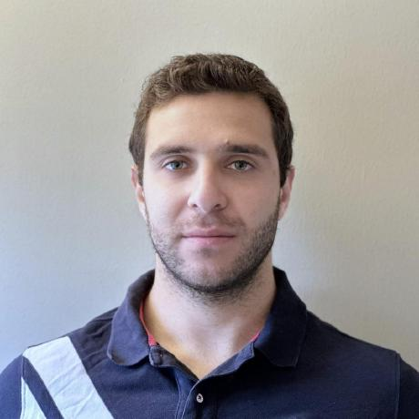

# ReddLab Mission, Vision, Values, Goals

📍 **ReddLab – Casey Eye Institute, OHSU, Portland, OR**  
👨‍⚕️ **Founded by Dr. Travis Redd, MD, MPH**  

---

## About Us
ReddLab is a research group based at the **Casey Eye Institute, Oregon Health & Science University (OHSU), Portland, OR**. We focus on leveraging cutting-edge **machine learning and AI** to enhance ophthalmology and global eye health. Our work spans clinical research, AI-driven diagnostics, and improving access to **corneal disease treatment and prevention** worldwide.

---

## Mission Statement
**Leverage technology to reduce corneal blindness.**

## Vision Statement
**Become world leaders in medical AI and responsibly implement machine learning systems to improve patient outcomes and reduce health inequity.**

## Core Values

1. **Respect.** We never denigrate ideas, we ensure everyone is given appropriate academic credit for their contributions, and we help each other’s career development.
2. **Diligence.** Focus on the details, we owe it to patients to create the best technology possible.
3. **Fun.** Our work is interesting, challenging, and could provide real-world benefit. Let’s enjoy it.

---

## 👥 Meet the Team

### **Principal Investigator**  

👨‍⚕️ **[Dr. Travis Redd, MD, MPH](https://www.ohsu.edu/providers/travis-redd-md-mph)**  
*Assistant Professor, Casey Eye Institute*  

Expert in AI applications in ophthalmology, public health, and corneal disease research.

📄 <strong>Publications & Research:</strong> <a href="https://scholar.google.com/citations?hl=en&user=giL6pA0AAAAJ&view_op=list_works&sortby=pubdate">Google Scholar</a>

### **Research Team**  

<h3>Dr. Jad F. Assaf, MD</h3>

<em>PostDoctoral Scholar</em>

Deep Learning for Corneal Imaging

<a href="https://github.com/JadAssaf">GitHub</a> | 
<a href="https://scholar.google.com/citations?user=8whDnjAAAAAJ&hl=en">Google Scholar</a> | 
<a href="http://linkedin.com/in/assafjad/">LinkedIn</a>

<h3>Dr. John Jackson, MD</h3>

<em>PostDoctoral Scholar</em>

Machine Learning, Image Processing, and Geometric Algebra

<a href="https://github.com/Otravezjj">GitHub</a>

<h3>Dr. Hady Yazbeck, MD</h3>

<em>PostDoctoral Scholar</em>

AI in Ophthalmology

<a href="https://github.com/Hadyazbeck">GitHub</a> | 
<a href="https://scholar.google.com/citations?user=7UEHJjIAAAAJ&hl=en&oi=ao">Google Scholar</a> | 
<a href="https://www.linkedin.com/in/hady-yazbeck-3984121a5/">LinkedIn</a>

---