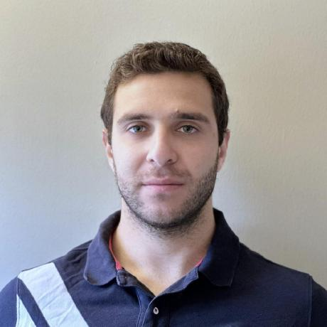

# ReddLab: AI-Driven Solutions for Global Eye Health

  

  <h3>👨‍⚕️ Founded by Dr. Travis Redd, MD, MPH</h3>

---

## 🔬 About Us

ReddLab is a research group based at the **Casey Eye Institute, Oregon Health & Science University (OHSU), Portland, OR**. We focus on leveraging cutting-edge **machine learning and AI** to enhance ophthalmology and global eye health. Our work spans clinical research, AI-driven diagnostics, and improving access to **corneal disease treatment and prevention** worldwide.

---

  
### 🎯 Mission
**Leverage technology to reduce corneal blindness.**

### 🌟 Vision
**Become world leaders in medical AI and responsibly implement machine learning systems to improve patient outcomes and reduce health inequity.**

---

## 💫 Core Values

<table>
<tr>
<td width="33%" align="center">
  <h3>🤝</h3>
  <b>Respect</b> 
  <em>We never denigrate ideas, ensure appropriate academic credit, and help each other's career development.</em>
</td>
<td width="33%" align="center">
  <h3>💪</h3>
  <b>Diligence</b> 
  <em>Focus on the details, we owe it to patients to create the best technology possible.</em>
</td>
<td width="33%" align="center">
  <h3>🎉</h3>
  <b>Fun</b> 
  <em>Our work is interesting, challenging, and could provide real-world benefit. Let's enjoy it.</em>
</td>
</tr>
</table>

---

## 🎯 Strategic Goals

1. **Responsibly develop machine learning systems** and novel imaging methods to determine the infectious etiology of corneal ulcers.
   - ✅ **Project:** [Automated KOH Smear Interpretation](https://github.com/Redd-Cornea-AI/KOH-Smear-DSMIL)  
   - 📌 Using **Dual Stream Multiple Instance Learning (DSMIL)** to automate **KOH smear analysis** for corneal ulcers.

2. **Develop AI models for automatic detection of trachoma**, ensuring responsible and ethical implementation.

3. **Invent novel approaches to weak supervision** for medical AI, improving the reliability of machine learning in healthcare.

4. **Create educational tools for clinicians** managing corneal diseases, enhancing their ability to diagnose and treat patients effectively.

---

## 👥 Meet the Team

### Principal Investigator

  
  <h3><a href="https://www.ohsu.edu/providers/travis-redd-md-mph">Dr. Travis Redd, MD, MPH</a></h3>
  <em>Assistant Professor, Casey Eye Institute</em> 
  Expert in AI applications in ophthalmology, public health, and corneal disease research  
  

### Research Team

<table>
  <tr>
    <td align="center" width="33%">
       
      <h4>Dr. Jad F. Assaf, MD</h4>
      <em>PostDoctoral Scholar</em> 
      Deep Learning for Corneal Imaging  
      

        
        
        
      

    </td>
    <td align="center" width="33%">
       
      <h4>Dr. John Jackson, MD</h4>
      <em>PostDoctoral Scholar</em> 
      Machine Learning, Image Processing, and Geometric Algebra  
      

        
      

    </td>
    <td align="center" width="33%">
       
      <h4>Dr. Hady Yazbeck, MD</h4>
      <em>PostDoctoral Scholar</em> 
      AI in Ophthalmology  
      

        
        
        
      

    </td>
  </tr>
</table>